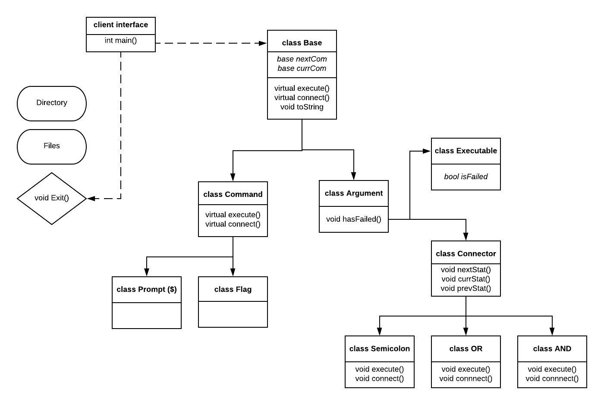

# CS 100 Programming Project
Winter 2020

Justin Gomez 		SID: 862035390

Alec Asatoorian 	SID: 862026505

## Introduction
The purpose of this project is to gain experience in developing a shell that utilizes system calls. Our objective is to utilized object oriented programming to develope a codebase that is reusable, maintainable, and upgradable. Our intended pipeline currently includes feeding user input into a parsing system which determines the user's intent. The parsing system will decide how to execute the given input piece by piece. It will examine input and check to see what type of input a string is, then will use the base class, which utilizes the composite design pattern, and allows other classes to inherit its functions. These functions, command, argument, and connector, will describe what actions to take based on a given parsed token.

## Diagram

## Classes

### Base

This class will contain basic functions that  parse, execute, and connect strings of commands as a list 

    class Base{
    	base nextCom;
    	base currCom;
    	virtual execute();
    	virtual connect();;
    	void toString();
    };

### Command

This class will contain its own implementation of execute() and connecting

    class Command : public Base{
    	void execute();
    	void connect();;
    };

### Prompt, Flag

This class will contain objects such as -a

    class Prompt : public Command{ };
    class Flag : public Command{ };

### Argument

    class Argument : public Base{
    	void hasFailed();
    };

### Executable

    class Executable : public Argument{
    	bool isFailed;
    };

### Connector

Base connector class for generic pass or fail statuses

    class Connector : public Argument{
    	void nextStat();
    	void currStat();
    	void prevStat();
    };

### Semicolon

Links previous and next commands like newline

    class Semicolin : public Connector{
    	void execute();
    	void connect();
    };

### OR

Links previous and next commands as logical "or" operator

    class OR : public Connector{
    	void execute();
    	void connect();
    };

### AND

Links previous and next commands as logical "and" operator

    class AND : public Connector{
    	void execute();
    	void connect();
    };

## Prototypes/Research

Our prototype directory includes two files (example.cpp, parser_example.cpp). The first file, example.cpp, includes a trial of our use of the three functions waitpid(), execvp(), and fork(). Here, we use fork() to enter a new process which calls execvp(). The sub-process ends and the original process finishes once waitpid() checks the child process and determines its termination. The second file, parser_example.cpp, illustrates our desired method for tackling the problems of parsing. We intend on using the boost library and creating a parsing grammar using boost's spirit parser framework. In the given example, we have included a tokenizer which parses user input, as well as an incomplete parser grammer, which has currently been commented out.  

## Development and Testing Roadmap
- Construct Base class and its virtual functions and variables
- Unit test Base class
- Code parser to split input into individual strings/ commands
- Unit test parser
- Construct Command class and its associated execute and connector functions
- Unit test Command class
- Integration testing with Command class and parser code, this includes testing with parents Base class
- Construct Connector class to adapt commands
- Construct Semicolon class to join prev and after commands
- Unit test Semicolon class
- Construct AND class to logicaly join commands
- Unit test AND class
- Construct OR class to logicaly join commands
- Unit test OR class
- Integration test parser and semicolon class, AND class, and OR class
