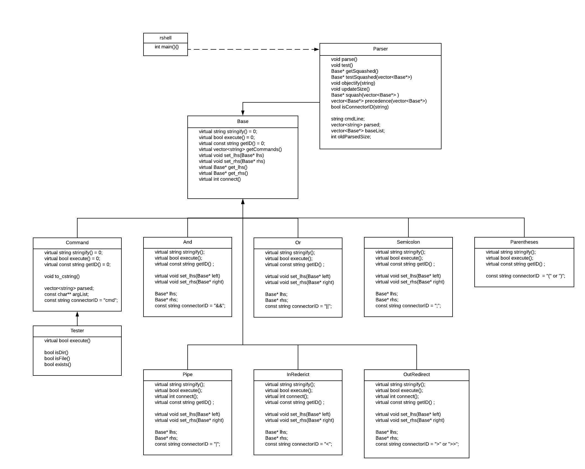

# CS 100 Programming Project
Winter 2020

Justin Gomez 		SID: 862035390

Alec Asatoorian 	SID: 862026505

## Introduction
The purpose of this project is to gain experience in developing a shell that utilizes system calls. Our objective is to utilized object oriented programming to develope a codebase that is reusable, maintainable, and upgradable. Our intended pipeline currently includes feeding user input into a parsing system which determines the user's intent. The parsing system will decide how to execute the given input piece by piece. It will examine input and check to see what type of input a string is, then will use the base class, which utilizes the composite design pattern, and allows other classes to inherit its functions. These classes (command, argument, and connector) will describe what actions to take based on a given parsed token.

After cloning, run

	git submodule update --init --recursive
  
## Diagram

## Classes

### Base

This class contains basic virtual functions that the Command, And, Or, and Semicolon classes will inherit from and will be the bases of our composite structure.

	virtual string stringify() = 0;
	virtual bool execute() = 0;
	virtual const string getID() = 0;
	virtual void set_lhs(Base* lhs)
	virtual void set_rhs(Base* rhs)
  

### Command

This class will act as the leaf obj in our structure. It will contain its own implementation of execute() which will be making the direct calls to execvp() and return a bool value to let any connector executing it know whether it failed or not.

  virtual string stringify() = 0;
	virtual bool execute() = 0;
	virtual const string getID() = 0;

	void to_cstring()

	vector<string> parsed;
	const char** argList;
	const string connectorID = "cmd";

### Exit

This class will inherit from Command class and will contain its own implementation of execute() which will call exit(0) to exit the rshell program.

	virtual bool execute()

	vector<string> parsed;
  const char** argList;
    

### OR

Links previous and next command objects to execute() as logical "or" operator.

	virtual string stringify();
	virtual bool execute();
	virtual const string getID() ;

	virtual void set_lhs(Base* left)
	virtual void set_rhs(Base* right)

	Base* lhs;
	Base* rhs;
	const string connectorID = "||";

### AND

Links previous and next commands objects to execute() as logical "and" operator.

	virtual string stringify();
	virtual bool execute();
	virtual const string getID() ;

	virtual void set_lhs(Base* left)
	virtual void set_rhs(Base* right)

	Base* lhs;
	Base* rhs;
	const string connectorID = "&&";

### Semicolon

Links previous and next command objects to execute() like newline.

	virtual string stringify();
	virtual bool execute();
	virtual const string getID() ;

	virtual void set_lhs(Base* left)
	virtual void set_rhs(Base* right)

	Base* lhs;
	Base* rhs;
	const string connectorID = ";";

### Parser

This class takes in a string for its constructor and has private function parse() which parses each string into it's associate object, taking into acount quotes and comments. This creates a vector of Base pointer objects which get passed into a function getSquashed which returns all of the objects compositely "squashed" into a single Base pointer to be executed.

	void parse()
	void test()
	Base* getSquashed()
	Base* testSquashed(vector<Base*>)
	void objectify(string)
	void updateSize()
	Base* squash(vector<Base*> )

	string cmdLine;
	vector<string> parsed;
	vector<Base*> baseList;
	int oldParsedSize;
	const string andOperator = "&&";
	const string orOperator = "||";
	const string scOperator = ";";
  
  
## Prototypes/Research

Our prototype directory includes two files (example.cpp, parser_example.cpp). The first file, example.cpp, includes a trial of our use of the three functions waitpid(), execvp(), and fork(). Here, we use fork() to enter a new process which calls execvp(). The sub-process ends and the original process finishes once waitpid() checks the child process and determines its termination. The second file, parser_example.cpp, illustrates our desired method for tackling the problems of parsing. We intend on using the boost library and creating a parsing grammar using boost's spirit parser framework. In the given example, we have included a tokenizer which parses user input, as well as an incomplete parser grammer, which has currently been commented out.  

## Development and Testing Roadmap
- Construct Base class and its virtual functions and variables
- Code parser to split input into individual strings/ commands
- Unit test parser
- Construct Command class and its associated execute and connector functions
- Unit test Command class
- Integration testing with Command class and parser code, this includes testing with parents Base class
- Construct Semicolon class to join prev and after commands
- Unit test Semicolon class
- Construct AND class to logicaly join commands
- Unit test AND class
- Construct OR class to logicaly join commands
- Unit test OR class
- Integration test parser and semicolon class, AND class, and OR class

## Testing

For unit tests, run from root dir
	
	cmake3 . && make && ./test
  
For integration tests, run from root dir

	cd integration_tests
	../rshell 
	./single_command_tests.sh && ./multiple_command_tests.sh && ./commented_command_tests.sh && ./exit_command_tests.sh
